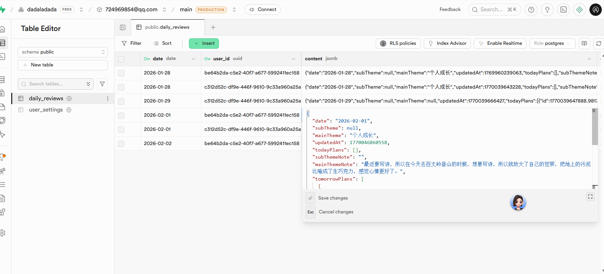

# AI 编程第二课：PRD 撰写与数据“画骨”

> **项目公网链接**：[https://four-seven-4-7.github.io/ai-daily-review/](https://four-seven-4-7.github.io/ai-daily-review/)
> **作业导航**：
> [第一课：痛点挖掘](lesson1.md) | [第二课：全栈实现](lesson2.md) | [第三课：AI 接入](lesson3.md) | [第四课：效率工具](lesson4.md)
> [第五课：开发迭代](lesson5.md) | [第六课：部署发版](lesson6.md) | [第七课：项目专项](lesson7.md) | [第八课：毕业路演](lesson8.md)

---


## 2.1 初阶作业：一份“画骨”的 PRD
**核心初衷**：告别假数据，让复盘真正落地。

### 📋 结构化复盘 PRD 核心摘要
本项目旨在设计一个能够实现**计划自动流转**（昨日的明日变今日）和**主题深度觉察**的智能复盘工具。

#### 1. 核心功能模块
*   **今日复盘区**：自动拉取昨日规划的“明日计划”，支持 Checkbox 标记完成及备注说明。
*   **明日规划区**：输入次日核心任务。系统通过公式 `$Plan_{tomorrow}(Day_N) \rightarrow Plan_{today}(Day_{N+1})$` 实现任务自动流转。
*   **主题觉察区**：支持“主/副主题”筛选。
    *   **记忆逻辑**：系统自动默认选中用户上次提交时的主题，减少重复操作。
    *   **主题库管理**：支持下拉搜索与关键字过滤。

#### 2. 交互原型示意 (Wireframe)
```text
+------------------------------------------------------+
|  1. 今日计划完成情况 (来自昨日规划)                   |
| [x] 事项 A  [ 备注：已完成，效果不错       ]         |
| [ ] 事项 B  [ 备注：延期到明天             ]         |
+------------------------------------------------------+
|  2. 明日计划完成事项                                  |
|  - [ 输入待办任务... ]                               |
+------------------------------------------------------+
|  3. 主题觉察 (支持下拉搜索与默认值记忆)               |
|  主主题: [ ▼ 默认上次主题 ] | 副主题: [ ▼ 选填 ]     |
|  [ 输入深度觉察内容... ]                              |
+------------------------------------------------------+
|               [    提 交 并 同 步    ]               |
+------------------------------------------------------+
```

## 2.2 进阶作业：全栈实现与数据库接入

### 🔐 数据库入库验证
拒绝假数据！本项目已完整接入 Supabase，实现了真正的全栈闭环。

> 💡 **手动操作提示**：导入飞书后，请将本地 `screen/screenshot_04.png` 拖拽到下方区域。


*图：Supabase Table Editor 实时观测到的复盘数据流*

---
© 2026 AI 编程课程作业 - 拒绝“画皮”，坚持“画骨”
