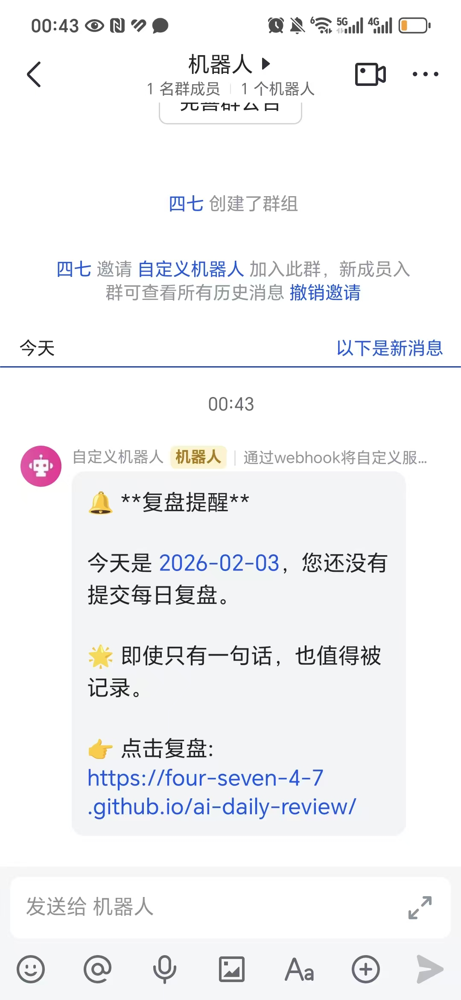

# AI 编程第三课：让产品“活”过来（AI Native）

> **项目公网链接**：[https://four-seven-4-7.github.io/ai-daily-review/](https://four-seven-4-7.github.io/ai-daily-review/)
> **作业导航**：
> [第一课：痛点挖掘](lesson1.md) | [第二课：全栈实现](lesson2.md) | [第三课：AI 接入](lesson3.md) | [第四课：效率工具](lesson4.md)
> [第五课：开发迭代](lesson5.md) | [第六课：部署发版](lesson6.md) | [第七课：项目专项](lesson7.md) | [第八课：毕业路演](lesson8.md)

---


## 3.1 初阶作业：接入 LLM 洞察能力

### 🤖 场景：自动化复盘专家
利用 API 接入 ModelScope 的 Qwen2.5 模型。它不再是简单的聊天，而是深度读取我过去一周的复盘数据，自动生成“避坑指南”。

### 🛠️ AI 功能工作流说明
为了让产品具备真正的智能，我设计了以下自动化工作流：
1.  **数据采集**：前端自动从 Supabase 提取过去 7 天的 `todayPlans`（完成情况）和 `mainThemeNote`（觉察感悟）。
2.  **Prompt 封装**：将原始数据喂给预设的“分析师提示词”。
3.  **API 调用**：通过 `fetch` 安全调用 ModelScope 接口。
4.  **结果渲染**：AI 返回的 Markdown 格式分析报告实时展示在模态框中。

### 交互验证
> 💡 **手动操作提示**：导入飞书后，请将本地 `screen/screenshot_02.png` 拖拽到下方区域。


*图：AI 正在执行复杂的逻辑分析，生成深度复盘报告*

### 📝 System Prompt 调优
```text
你是一个冷静、犀利的个人成长教练。
请基于用户本周的 flomo 复盘记录，找出他一直在逃避的“重要不紧急”事项，
并用不超过 150 字的篇幅给出下周的执行建议。
```

## 3.2 进阶作业：自动化通知流

### 🔔 飞书机器人实时通知
除了 AI 分析，我还接入了飞书 Webhook 提醒工作流，确保复盘行为的持续性。

#### 工作流架构：
`GitHub Actions (定时触发)` -> `Node.js 脚本` -> `Supabase (查询今日完成情况)` -> `飞书 Webhook` -> `手机通知`

> 💡 **手动操作提示**：导入飞书后，请将本地 `screen/screenshot_05.jpg` 拖拽到下方区域。


*图：每天定时收到的飞书自动化提醒，确保复盘不遗漏*

---
© 2026 AI 编程课程作业 - 让 AI 成为真实生产力
