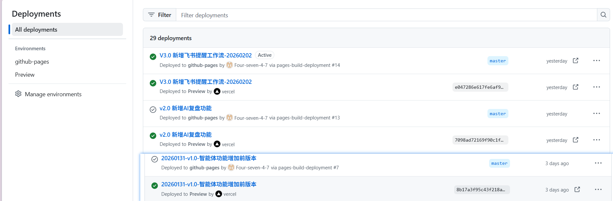

# AI 编程第四课：效率工具与真实踩坑复盘

> **项目公网链接**：[https://four-seven-4-7.github.io/ai-daily-review/](https://four-seven-4-7.github.io/ai-daily-review/)
> **作业导航**：
> [第一课：痛点挖掘](lesson1.md) | [第二课：全栈实现](lesson2.md) | [第三课：AI 接入](lesson3.md) | [第四课：效率工具](lesson4.md)
> [第五课：开发迭代](lesson5.md) | [第六课：部署发版](lesson6.md) | [第七课：项目专项](lesson7.md) | [第八课：毕业路演](lesson8.md)

---

## 4.1 初阶作业：解决项目中的真实痛点

### 🛠️ 痛点描述
在开发“数据同步”逻辑时，我因为过度追求功能，导致 LocalStorage 与 Supabase 的状态发生严重冲突，页面反复刷新，项目差点崩溃。

### 解决过程
1.  **AI 协助定位**：将控制台的报错信息完整复制给 AI。
2.  **工程决策**：意识到“需求蔓延”的危害，果断回退到稳定版本。
3.  **最终方案**：采用“输入即存本地，提交才上云”的异步分层策略。

## 4.2 进阶作业：安全防范与 Skills 实践

### 🛡️ 密钥保护实战
我曾不小心将包含 API Key 的文件推送到 GitHub，幸好被 GitHub 的安全扫描机制（Secret Scanning）及时拦截并提醒。

> 💡 **手动操作提示**：导入飞书后，请将本地 `screen/screenshot_06.png` 拖拽到下方区域。

*图：GitHub 成功拦截敏感信息提交，保护了项目资产*

### 💡 学习心得
*   **不要贪多**：MVP 阶段功能越少越稳。
*   **安全至上**：API Key 必须存储在环境变量或数据库中，严禁硬编码。

---
© 2026 AI 编程课程作业 - 踩坑是成长的必经之路
