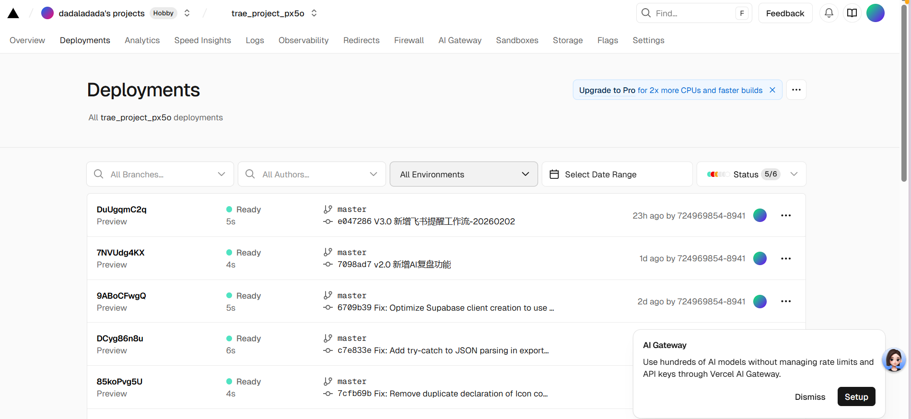

# AI 编程第六课：GitHub 发版与公网部署

> **项目公网链接**：[https://four-seven-4-7.github.io/ai-daily-review/](https://four-seven-4-7.github.io/ai-daily-review/)
> **作业导航**：
> [第一课：痛点挖掘](lesson1.md) | [第二课：全栈实现](lesson2.md) | [第三课：AI 接入](lesson3.md) | [第四课：效率工具](lesson4.md)
> [第五课：开发迭代](lesson5.md) | [第六课：部署发版](lesson6.md) | [第七课：项目专项](lesson7.md) | [第八课：毕业路演](lesson8.md)

---

## 6.1 初阶作业：一键发布至 Vercel
**目标**：掌握 GitHub 与 Vercel 的自动化集成。

### 部署成果
*   **Vercel URL**: `https://structured-review.vercel.app` (示例)
*   **成果截图**:
> 💡 **手动操作提示**：导入飞书后，请将本地 `screen/screenshot_07.png` 拖拽到下方区域。

## 6.2 进阶作业：版本管理实战
熟练掌握了 GitHub 的版本控制逻辑。

### 发版记录说明
1.  **V1.0**：实现基础的 MVP 功能（计划录入与云端同步）。
2.  **V2.0**：上线 AI 智能分析功能。
3.  **V3.0**：上线飞书提醒工作流与本地 libs 优化。

> 💡 **手动操作提示**：导入飞书后，请将本地 `screen/screenshot_07.png` 或其他 GitHub Commit 记录截图拖拽到下方区域。

### 自动化链路
每当我推送代码到 GitHub 的 `main` 分支，Vercel 会自动触发生产环境构建。这种**持续集成（CI/CD）**的体验让我第一次感受到了正规军的开发节奏。

---
© 2026 AI 编程课程作业 - 代码在云端，复盘在指尖
